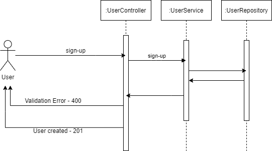
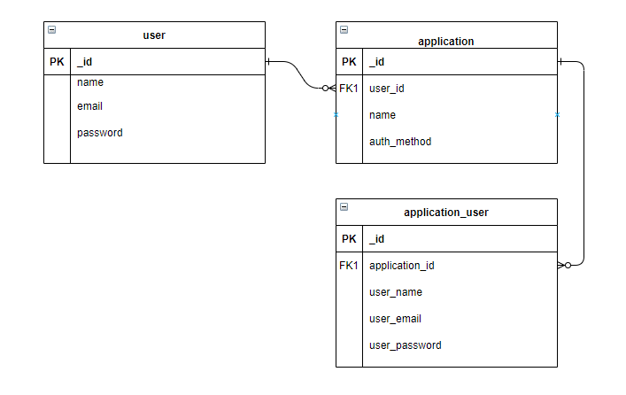

# User Base API
A microservice to store users and perform authentication for them.
The API uses MongoDB as datastore. 

Technologies:
- Java 11
- Bean Validation
- JUnit5
- MongoDB
- Spring Security

### Running
* Create a mongoDb database with collections according database image below.
* Get a connection string from Atlas and set the env vars: MONGODB_URI and
  MONGODB_DATABASE_NAME
* Clone the repo
* Compile with tests:
  > mvn clean install
* Compile without tests:
  > mvn clean install -DskipTests=true
* Just run tests:
  > mvn clean test
* Run the application:
  > mvn spring-boot:run

### Flow and classes
#### Application flow:

#### Database:

